# Análise de Classificadores em Múltiplas Bases de Dados

Este projeto compara o desempenho de 4 algoritmos de classificação (Regressão Logística, k-NN, Árvore de Decisão e Random Forest) em 3 bases de dados distintas, conforme solicitado na atividade.

O objetivo é carregar os dados, pré-processá-los, treinar os modelos, avaliar as métricas e analisar os resultados e fronteiras de decisão.

## Execução

1.  **Dependências:**
    ```bash
    pip install scikit-learn pandas matplotlib
    ```

2.  **Dataset:**
    * Os datasets `Covertype` e `Adult` são baixados automaticamente pelo `sklearn`.
    * O dataset `Credit Card Fraud` **deve** ser baixado manualmente do Kaggle e o arquivo `creditcard.csv` deve ser colocado na raiz deste projeto.

3.  **Rodar a Análise:**
    ```bash
    python main.py
    ```
    * O script criará um diretório `plots/` e salvará todas as matrizes de confusão e gráficos de fronteiras como arquivos `.png`, sem bloquear a execução.

---

## Resultados da Análise

### 1. Covertype (Florestas)

* **Dataset:** 581.012 amostras, 54 features.
* **Target:** Classe 1 (Spruce/Fir) vs. Outras.
* **Métricas Principais (Teste):**

| Modelo | Acurácia | ROC-AUC | F1 (Classe 1) |
| :--- | :--- | :--- | :--- |
| Regressão Logística | 0.77 | 0.8420 | 0.67 |
| k-NN (k=5) | 0.95 | 0.9835 | 0.93 |
| Árvore de Decisão (Depth=10) | 0.84 | 0.9095 | 0.78 |
| **Random Forest (100 Trees)** | **0.96** | **0.9946** | **0.95** |

* **Comentários:**
    * **Melhor Desempenho:** O Random Forest (Acurácia 0.96, ROC-AUC 0.99) foi o modelo vencedor, lidando muito bem com o alto número de features.
    * **Onde mais errou:** A Regressão Logística teve o pior desempenho (Acurácia 0.77), errando principalmente em identificar a classe positiva (Recall de 0.65).

* **Matrizes de Confusão:**
    <p align="center">
      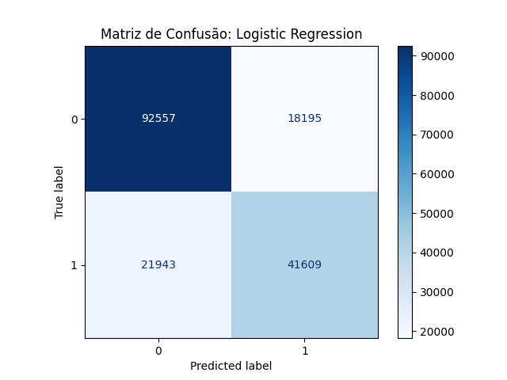
      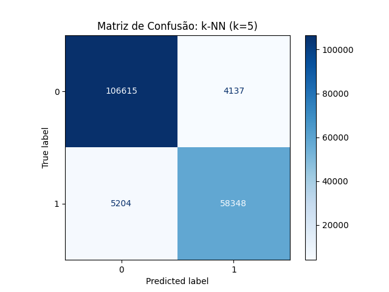
      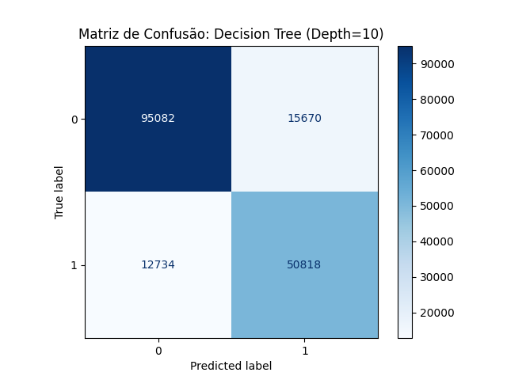
      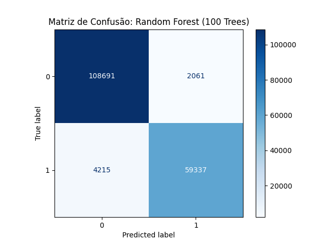
    </p>

* **Fronteiras de Decisão (Features: Elevation vs Aspect):**
    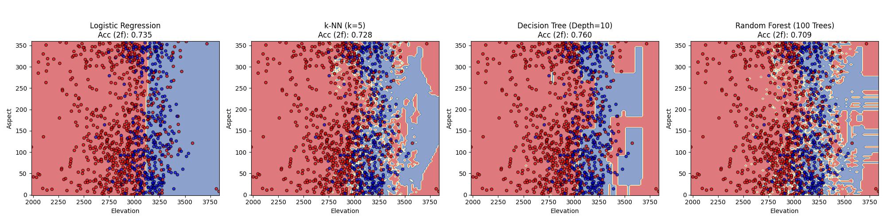

---

### 2. Adult / Census Income

* **Dataset:** ~48 mil amostras, 14 features (processadas para 108 com OHE).
* **Target:** Renda >50K vs. ≤50K.
* **Métricas Principais (Teste):**

| Modelo | Acurácia | ROC-AUC | F1 (Classe 1) |
| :--- | :--- | :--- | :--- |
| **Regressão Logística** | 0.86 | **0.9069** | 0.66 |
| k-NN (k=5) | 0.83 | 0.8579 | 0.64 |
| Árvore de Decisão (Depth=10) | 0.86 | 0.9047 | 0.67 |
| Random Forest (100 Trees) | 0.86 | 0.9028 | 0.67 |

* **Comentários:**
    * **Melhor Desempenho:** A Regressão Logística obteve o maior ROC-AUC (0.9069), indicando a melhor capacidade de separação entre as classes. A Árvore de Decisão e o Random Forest tiveram o melhor F1-Score (0.67) para a classe positiva.
    * **Onde mais errou:** Todos os modelos tiveram dificuldade em identificar a classe positiva (renda >50K). O erro principal foi o baixo Recall (entre 0.59 e 0.62), classificando erroneamente muitas pessoas de alta renda como se fossem de baixa renda.

* **Matrizes de Confusão:**
    <p align="center">
      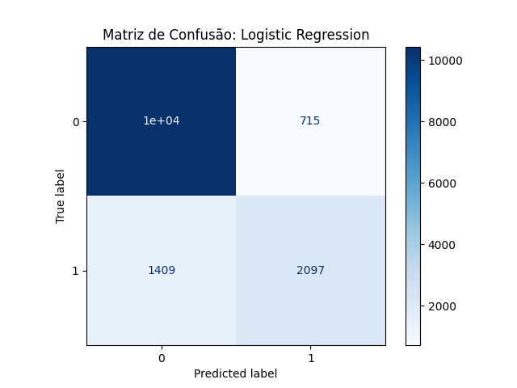
      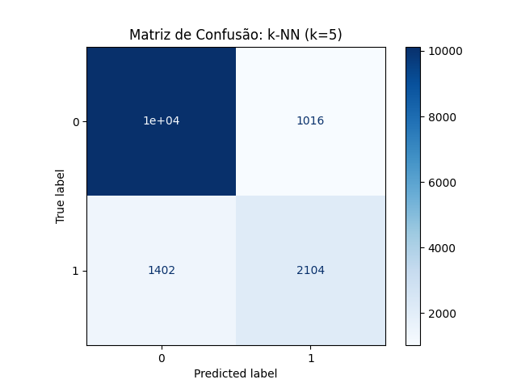
      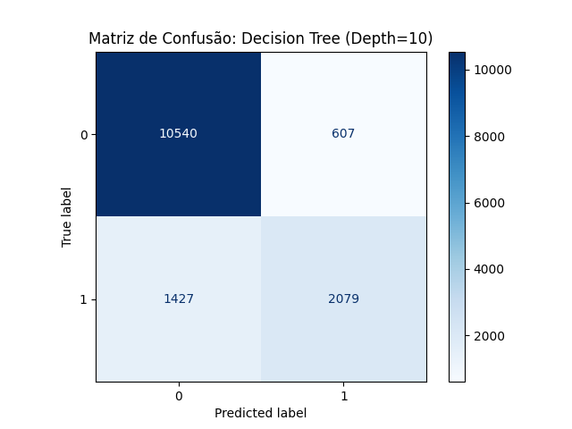
      
    </p>

* **Fronteiras de Decisão (Features: age vs hours-per-week):**
    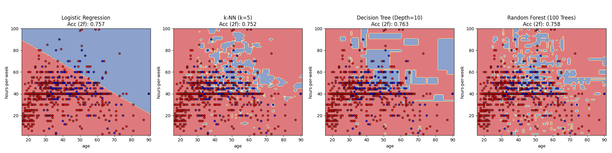

---

### 3. Credit Card Fraud

* **Dataset:** ~284 mil amostras, 30 features.
* **Target:** Fraude (1) vs. Não-Fraude (0). (Extremamente desbalanceado)
* **Métricas Principais (Teste):**

| Modelo (com `class_weight=balanced`*) | Recall (Fraude) | ROC-AUC | F1 (Fraude) | Precisão (Fraude) |
| :--- | :--- | :--- | :--- | :--- |
| **Regressão Logística*** | **0.88** | **0.9681** | 0.12 | 0.07 |
| k-NN (k=5) | 0.73 | 0.9188 | 0.81 | 0.92 |
| Árvore de Decisão (Depth=10) | 0.74 | 0.8423 | 0.80 | 0.88 |
| Random Forest* | 0.71 | 0.9275 | 0.82 | 0.97 |

* **Comentários:**
    * **Melhor Desempenho (Detecção):** A Regressão Logística com balanceamento de classe foi a melhor em *identificar* fraudes (Recall de 0.88), como visto no `ROC-AUC` (0.97).
    * **Melhor Desempenho (Equilíbrio):** O Random Forest (F1 0.82) e o k-NN (F1 0.81) foram os modelos mais equilibrados, com alta precisão e recall razoável.
    * **Onde mais errou:** A Regressão Logística errou ao gerar um volume extremo de Falsos Positivos (Precisão de 0.07). Os outros modelos (k-NN, RF) erraram ao deixar passar mais fraudes (Falsos Negativos), falhando em detectar ~27-29% delas.

* **Matrizes de Confusão:**
    <p align="center">
      
      
      
      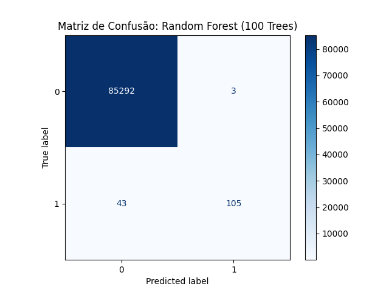
    </p>

* **Fronteiras de Decisão (Features: V1 vs V2):**
    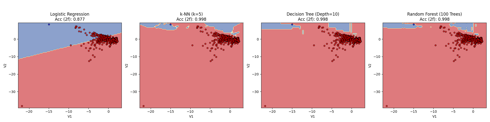
